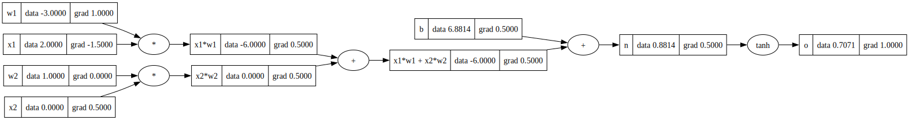
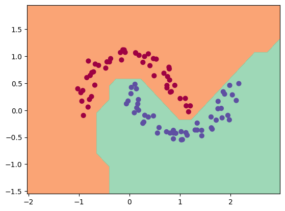

# 🧠 MicroGrad – *Autograd & Neural Nets from Scratch*

> A minimalist deep learning engine from the ground up — inspired by Andrej Karpathy's [micrograd](https://github.com/karpathy/micrograd)

---

## 🔍 Introduction

This project is a faithful reimplementation of a **tiny automatic differentiation engine** and **neural network module**, designed for learning the inner workings of deep learning systems.

At its core, the engine performs **reverse-mode automatic differentiation** (backpropagation) over a **dynamically built computation graph (DAG)** using only scalar values. Despite its minimal design, this is powerful enough to construct and train **multi-layer perceptrons (MLPs)** for tasks like binary classification.

> Every neuron is manually built from a chain of tiny operations — like additions, multiplications, and non-linear activations — giving a clear view of how deep learning really works under the hood.

Ideal for **educational purposes**, this project demystifies how libraries like PyTorch compute gradients and update parameters.

---

### 📸 Backpropagation Visualization

> Gradients are propagated backward through the computation graph via reverse-mode autodiff:

<p align="center">
  
</p>

---

## 📂 Project Structure

| File             | Description                                                              |
| ---------------- | ------------------------------------------------------------------------ |
| `engine.py`      | Core autograd engine implementing the `Value` class with custom backprop |
| `neural_nets.py` | A simple MLP built with `Neuron`, `Layer`, and `MLP` classes             |
| `demo.ipynb`     | Notebook demonstrating training, backpropagation, and visualization      |

---

## 📒 Demo Notebook Overview

The notebook `demo.ipynb` walks through the **training of a 2-layer neural network (MLP)** for binary classification.

A neural net is built using the `MLP` class from the `neural_nets.py` module. A basic **SVM-style max-margin loss** is used to drive the learning, and **stochastic gradient descent (SGD)** is implemented for weight updates.

The model architecture consists of:

* Two hidden layers with **16 neurons each**
* ReLU activations
* A scalar output for binary classification

The model is trained on the classic **"two moons" dataset**, and successfully learns a smooth, non-linear decision boundary.

---

### 📊 Final Output (Decision Boundary)

> Visualization of the learned decision boundary after training:

<p align="center">
  
</p>

---

## 🧠 Concepts Learned

This project helped reinforce the following foundational machine learning concepts:

* ✅ Reverse-mode **automatic differentiation (autograd)**
* ✅ **Computation graphs** for backpropagation
* ✅ Custom **`Value` class** with tracking of gradients
* ✅ Construction of **neural networks from scratch** using layers and neurons
* ✅ Forward + backward pass, training loop, and manual **gradient descent**
* ✅ Loss functions and optimization fundamentals

---

## 📌 Why This Project Matters

Learning to build an autograd engine and neural net manually provides:

* 🔍 A deeper understanding of **how PyTorch/TensorFlow work internally**
* 💪 Confidence to debug or extend deep learning systems
* 🧠 A solid foundation to implement custom ML architectures in real-world projects

---

## 🚀 Future Improvements

* [ ] Add support for tensors and batched inputs
* [ ] Extend loss functions (e.g. cross-entropy)
* [ ] Implement softmax, dropout, and more activations
* [ ] Add a visualization tool for DAG debugging

---

## 🙌 Credits

* 💡 Inspired by [Andrej Karpathy’s micrograd](https://github.com/karpathy/micrograd)

---

## 🧪 Run the Notebook

```bash
# Install dependencies
pip install numpy matplotlib

# Launch notebook
jupyter notebook demo.ipynb
```

---

